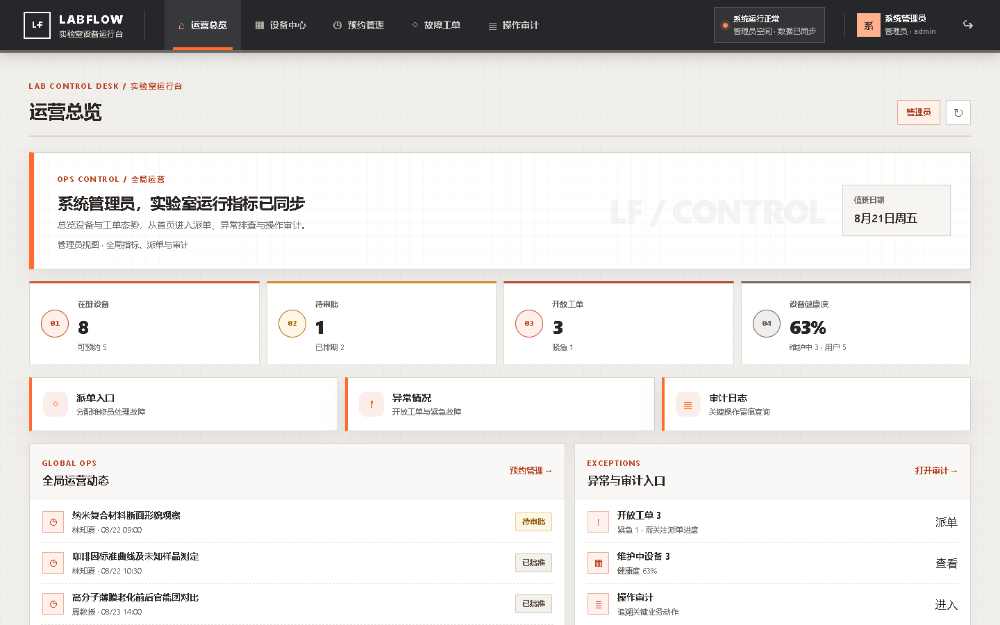
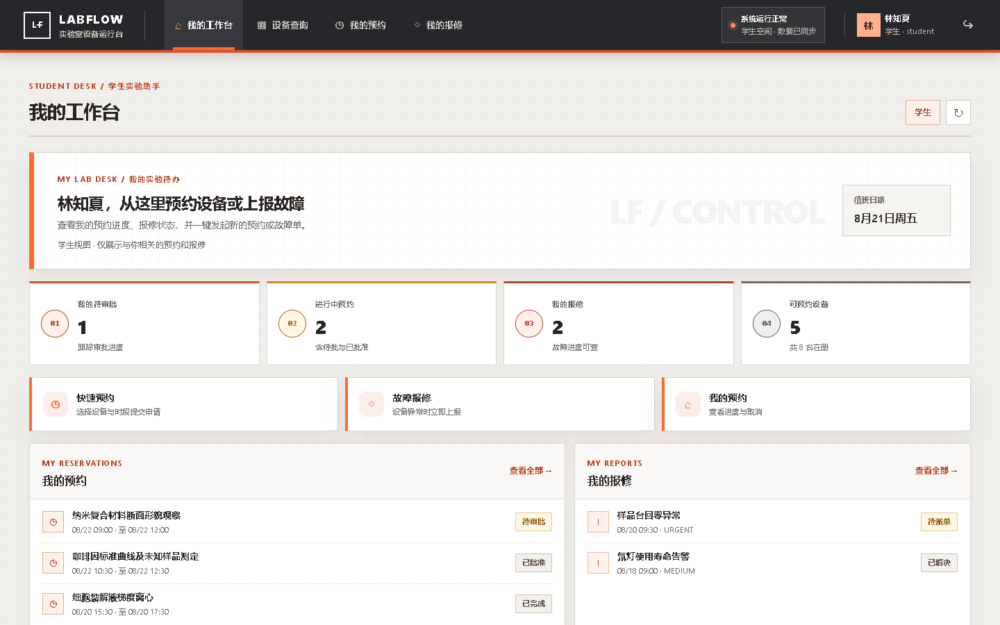
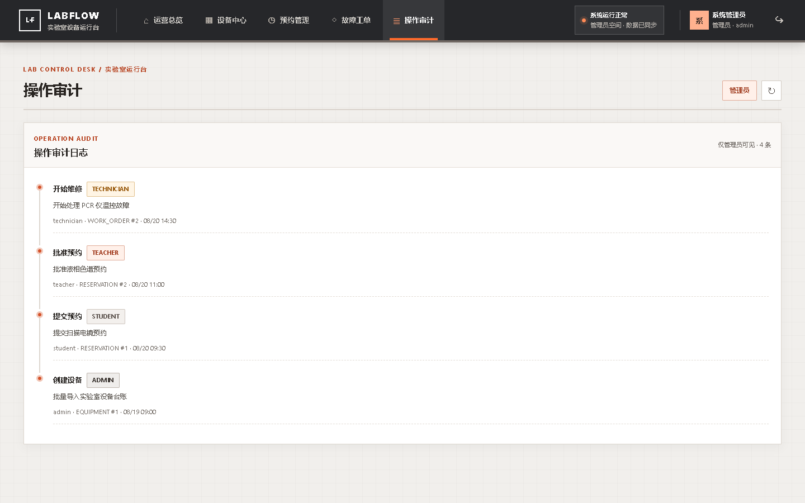
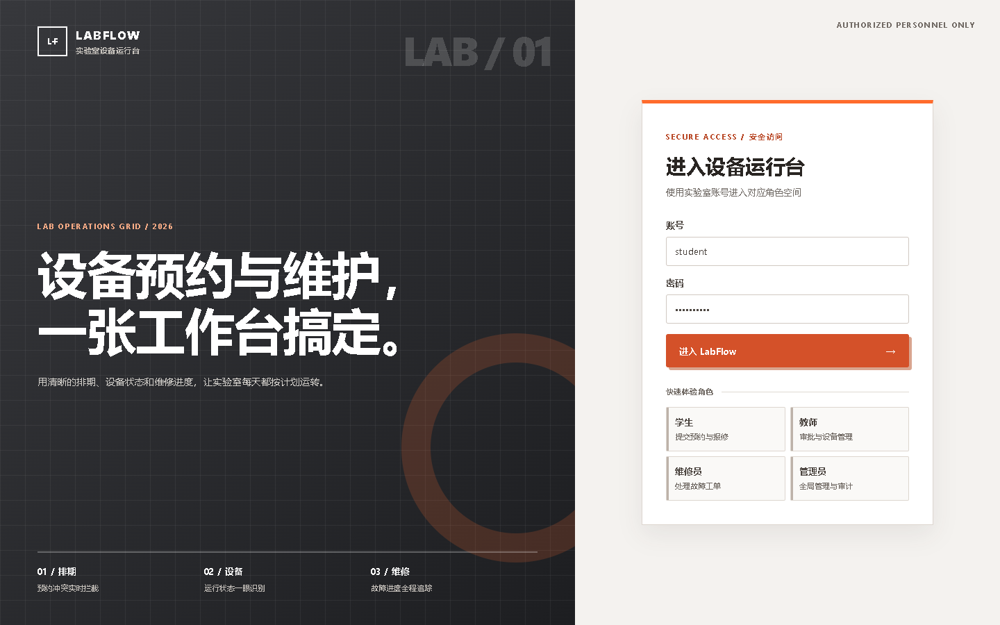
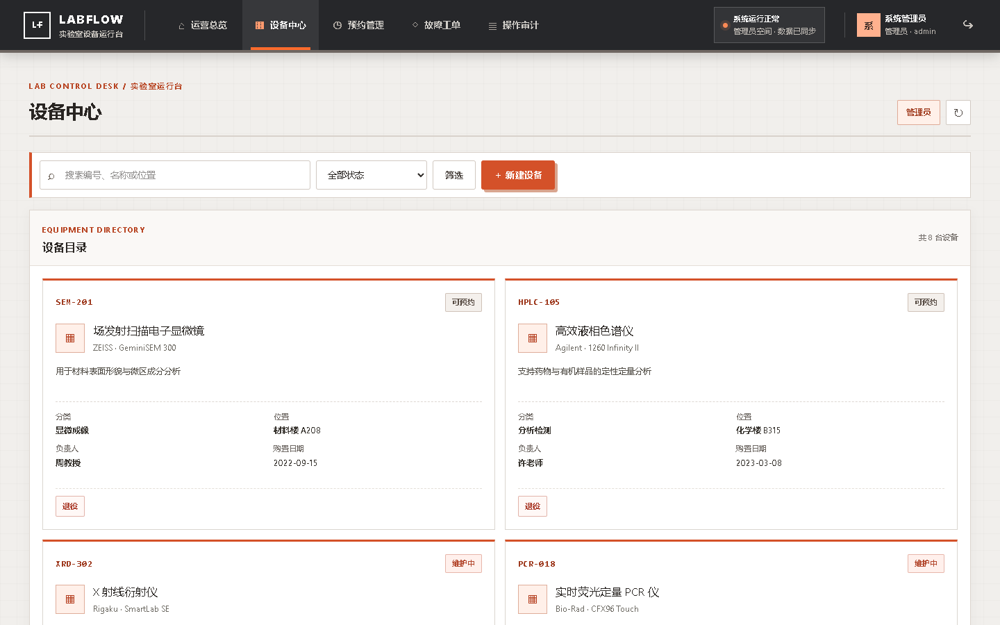
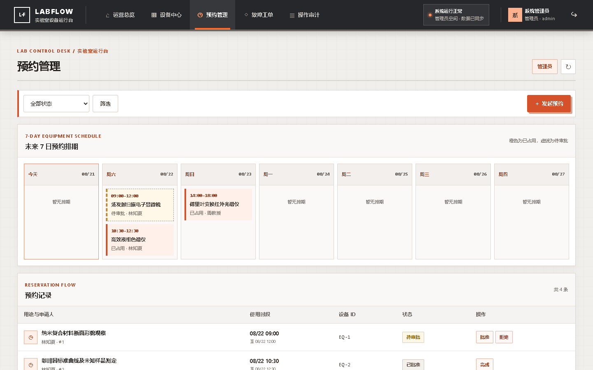
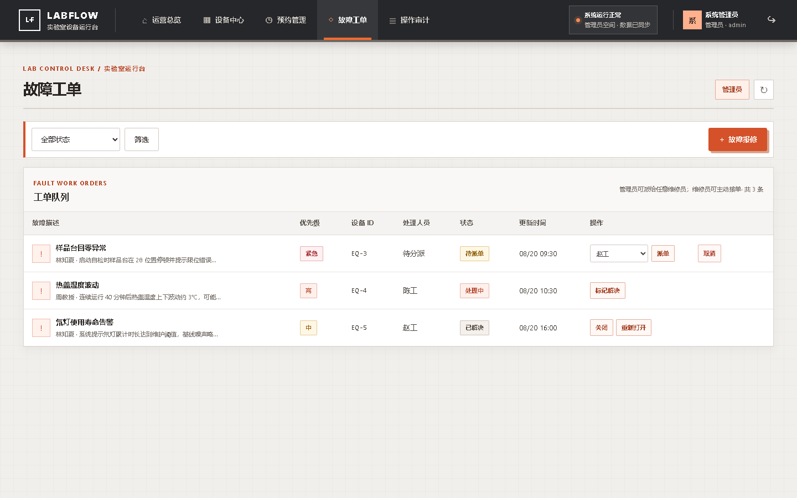
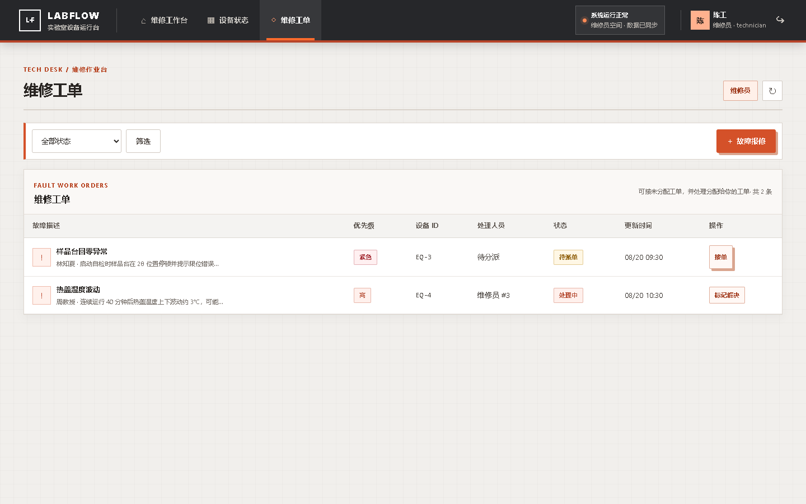

# LabFlow 实验室设备预约与故障工单平台

[](https://github.com/wuWhite688/LabFlow/actions/workflows/ci.yml)

面向高校实验室的设备运营系统：管台账、管预约、管报修。学生提交预约，教师审批，维修员处理故障，管理员看全局与审计。适合作为可演示的后端工程项目。

## 界面预览

> 以下截图全部来自本机真实运行的服务，走的是默认 H2 profile（`.\start-fullstack.ps1`，零外部中间件），
> 数据是启动时写入的演示种子：8 台设备、4 条预约、3 条工单与对应审计记录。

**运营总览（管理员）**：设备在册数、待审批、开放工单与设备健康度四项指标，右侧汇聚异常与审计入口。



**同一套 app shell，导航按角色收窄**。学生登录后只剩四个入口（没有「操作审计」），标题与文案也随角色切换，列表只展示与本人相关的预约和报修——权限不是靠前端藏按钮，服务端的申请人一律取登录用户。



**操作审计**：谁、在什么角色下、对哪个对象做了什么，全部留痕，仅管理员可见。



<details>
<summary>登录页与其余业务页面</summary>











</details>

## 能跑通的主流程

**预约：** 选设备与时段 → 进入 `PENDING` → 教师批准为 `APPROVED` → 超时未批自动 `EXPIRED` → 用完后 `COMPLETED`。重叠的待审批可以同时存在；真正占住时段的只有已批准预约。

**报修：** 提交工单 → 有权限的报修会取消冲突预约并让设备进入维护 → 管理员派单或维修员接单 → 处理、解决、关闭后设备恢复可预约。

**角色：** 学生 / 教师 / 维修员 / 管理员。申请人、报修人一律取服务端登录用户，不接受前端伪造。

## 技术栈

后端：Java 21、Spring Boot 3.5、Spring Security、JPA、Flyway。默认 H2；production 用 MySQL + Redis + RabbitMQ。

前端：React 19、TypeScript、Vinext/Vite。访问入口 `http://localhost:13000`（代理到后端 `18080`）。

## 预约并发

创建预约时锁在事务外面，避免锁先释放、事务后提交：

```text
ReservationApplicationService.create
└─ executeUser(userId)                 用户应用锁（配额）
   └─ execute(equipmentId)             设备应用锁
      └─ @Transactional ReservationService.create
         ├─ PlatformUser FOR UPDATE
         ├─ 统计 PENDING+APPROVED 是否超配额
         ├─ Equipment FOR UPDATE
         ├─ 时段冲突：只与 APPROVED 比较
         └─ insert
```

本地默认 `labops.reservation-lock.mode=local`（进程内公平锁）。production 切 Redis：`SET NX PX` 抢锁，Lua 比对 token 再 `DEL`，Redis 挂了直接 503，不降级成无锁。

状态变更（审批 / 取消 / 完成 / 过期 / 报修联动）固定 **Equipment → Reservation** 行锁，避免和创建路径形成 ABBA。创建路径是 **User → Equipment**，全项目没有反过来先锁设备再锁用户。

设备行锁是正确性底线：即使 Redis 租约（默认 10s）先过期，同一设备的写入仍在数据库串行。Redis 锁主要用来把冲突挡在事务前，减少排队。临界区没有外部 IO，所以没有做锁续期，也没有引入 Redisson。

## 预约语义

| 规则 | 行为 |
| --- | --- |
| 创建 | 多条时间重叠的 `PENDING` 可以并存 |
| 配额 | `PENDING + APPROVED` 计入上限（默认 20） |
| 占时段 | 只有 `APPROVED` 占用设备日历 |
| 审批 | 已过审批截止时间或预约已结束时返回 409；已有重叠 `APPROVED` 时也返回 409；并发审批最多一条成功 |
| 其它 | 开始时间必须在未来；单次最长 12 小时；最多提前 30 天 |

压测数据在 [`benchmark/RESULTS.md`](benchmark/RESULTS.md)。那组「同一时段只成功一条」是当时创建也把 `PENDING` 当冲突时的结果；现在冲突发生在审批，不是创建。

## 超时过期（RabbitMQ）

production：`labops.reservation-expiry.mode=rabbit`。

1. 审批截止时间取「创建时间 + 审批时限」与预约结束时间的较早者；每条待审批预约一条私有 delay queue：`labops.reservation.expiry.delay.{id}.{expiresAtMs}`
2. 队列 TTL + DLX，到期进入共享工作队列
3. 监听器执行过期；非法 payload（如 `not-a-number`）记 warning 后 ack 丢掉，不重投
4. 空闲队列用 `x-expires` 自动删
5. `ReservationExpiryCompensationJob` 始终扫库兜底

本地默认 `expiry.mode=local`，不需要 broker。旧的共享 FIFO delay queue 启动时会清掉。真 broker 上的 HOL 验证见 `RabbitReservationExpiryOrderingIntegrationTest`（本机 `5672` 不通则跳过）。

## 认证与安全默认

- Access JWT（HS256，默认 15 分钟）只放前端内存；Refresh 是不透明随机串，HttpOnly Cookie，库里只存 SHA-256，事务内 `FOR UPDATE` 轮换
- 过滤器每次查库：用户删除/停用立即 401；权限用数据库角色，JWT 里的 role 不算数
- 登录限流：IP+用户名 与 IP 总量（默认 5 / 20 / 15 分钟）；BFF 优先取 Cloudflare/Vercel 的边缘地址并覆盖为 `X-BFF-Client-IP`，后端只在 loopback/私有服务网来源上信任它，所以后端仍须保持内网可达
- 默认 `server.address=127.0.0.1`；非 loopback 禁止 demo 账号/种子，并拒绝占位 JWT
- 分页 `size` 上限 100
- production 必须提供 `JWT_SECRET`（≥32 字节、非 placeholder），demo 默认关闭

接口：`POST /api/auth/login`、`/refresh`、`/logout`。密码 BCrypt。Refresh Cookie：`HttpOnly`、`SameSite=Lax`、路径 `/api/auth`（前端代理成 `/api/backend/api/auth`）；production 默认 `Secure`。

## 一键演示（H2，零中间件）

需要 JDK 21+、Node.js 22+。

```powershell
.\start-fullstack.ps1
# 浏览器 http://localhost:13000
.\stop-fullstack.ps1
```

| 角色 | 用户名 | 密码 |
| --- | --- | --- |
| 学生 | `student` | `student123` |
| 教师 | `teacher` | `teacher123` |
| 维修员 | `technician` | `tech123` |
| 管理员 | `admin` | `admin123` |

启动后写入 8 台设备、4 条预约、3 条工单和审计，便于演示。绑定 loopback，不要把这个密钥和体验账号暴露到公网。

## 本地 production（MySQL + Redis + RabbitMQ）

中间件端口只绑 `127.0.0.1`。

```powershell
if (-not (Test-Path .env)) { Copy-Item .env.example .env }  # 填入 JWT_SECRET，不要提交 .env
.\scripts\start-middleware.ps1
.\scripts\start-production.ps1
# health: http://127.0.0.1:18080/actuator/health
.\scripts\verify-production.ps1
.\scripts\stop-production.ps1 -AlsoMiddleware
```

`verify-production.ps1` 会起栈、查 health（db/redis/rabbit）、确认 Flyway、打 Redis 锁日志和 Rabbit 过期调度日志。本机 HTTP 验证会临时关掉 Refresh Cookie 的 `Secure`，不改 `.env`。

没有 Docker Desktop 时，脚本会走 WSL Ubuntu Docker，并写 `.runtime/wsl-keepalive.pid` 防止发行版休眠。

JDK 解析顺序：`-JavaPath` → `JAVA_HOME` → `PATH`。`.\build.ps1` 必须打出可运行 JAR；`start-production.ps1 -SkipBuild` 会拒绝过期 JAR。

## 测试

```powershell
.\build.ps1          # mvnw package，含测试并产出 jar
cd frontend
npm test
npm run build
```

后端覆盖权限、JWT 查库与降权、登录限流、配额、重叠 PENDING 审批、锁顺序、过期与工单状态机。默认 `mvn test` 不需要 MySQL/Redis/Rabbit。

## 面试时可以这样说

> 这是实验室设备预约和报修系统。难点在并发预约、超时审批和多角色权限。创建时按用户再按设备加锁，数据库再加悲观写锁；待审批可以重叠，批准时才占时段，并发审批最多过一条。超时用每预约一条 Rabbit 延迟队列，非法消息直接丢弃，数据库扫描兜底。JWT 每次查库，登录按 IP 限流，默认只绑 127.0.0.1，公网不会带着体验账号启动。

## 还可以做的

- 校园统一登录
- 设备图片 / 二维码 / 培训资质
- 日历排期
- 通知、维修 SLA、导出
- 登出后作废未过期的 Access Token（当前只吊销 Refresh）
